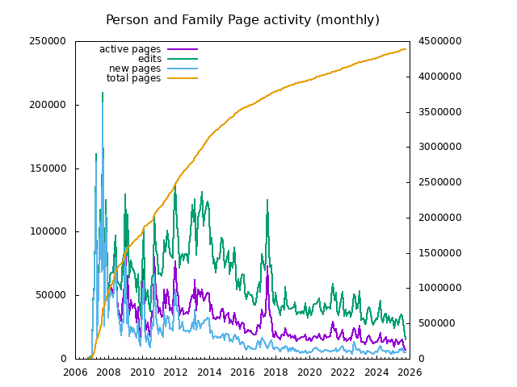
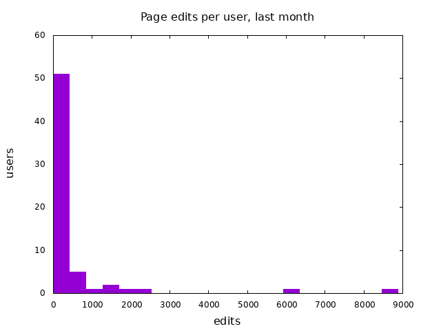
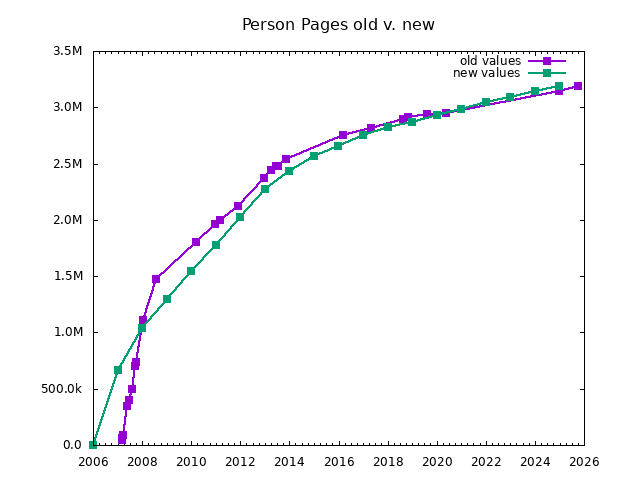

This is a collection of tools for working with WeRelate.  The primary tool, at this point, is a script for gathering history and then generating reports about WeRelate activity.

Monthly activity summaries:
* [last month](reports/report-lastmonth.md)
* [this month](reports/report-thismonth.md)

Here remixed version [the old growth graph](https://www.werelate.org/wiki/Image:Werelate_growth_v2.jpg):

The following charts are first attempts from incomplete (but mostly complete) data:

from data in [reports/tot-annually.csv](reports/tot-annually.csv)

 from data in
[reports/tot-lastmonth-daily.csv](reports/tot-lastmonth-daily.csv)
[reports/tot-thismonth-daily.csv](reports/tot-thismonth-daily.csv)

from data in [reports/tot-monthly.csv](reports/tot-monthly.csv)

from data in [reports/tot-monthly.csv](reports/tot-monthly.csv)

from data in [reports/tot-persons-old.csv](reports/tot-persons-old.csv)

from data in [reports/user-alltime.csv](reports/user-alltime.csv)

from data in [reports/user-alltime.csv](reports/user-alltime.csv)

from data in [reports/user-thismonth.csv](reports/user-thismonth.csv)

from data in [reports/tot-monthly.csv](reports/tot-monthly.csv)

from data in [reports/user-retention-monthly.csv](reports/user-retention-monthly.csv)

from data in [reports/user-alltime.csv](reports/user-alltime.csv)

from data in [reports/tot-annually.csv](reports/tot-annually.csv) [reports/tot-persons-old.csv](reports/tot-persons-old.csv)

Other data files:

[reports/page-score-top.csv](reports/page-score-top.csv)
[reports/tot.csv](reports/tot.csv)
[reports/tot-lastmonth.csv](reports/tot-lastmonth.csv)
[reports/tot-monthly2.csv](reports/tot-monthly2.csv)
[reports/tot-thismonth.csv](reports/tot-thismonth.csv)
[reports/user-lastmonth.csv](reports/user-lastmonth.csv)
[reports/user-new-lastmonth.csv](reports/user-new-lastmonth.csv)
[reports/user-new-monthly.csv](reports/user-new-monthly.csv)
[reports/user-new-thismonth.csv](reports/user-new-thismonth.csv)
[reports/user-thisweek.csv](reports/user-thisweek.csv)
[reports/verify-newver.csv](reports/verify-newver.csv)

