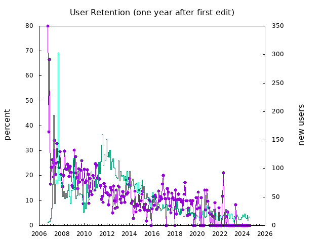

This is a collection of tools for working with WeRelate.  The primary tool, at this point, is a script for gathering history and then generating reports about WeRelate activity.

Monthly activity summaries:
* [last month](reports/report-lastmonth.md)
* [this month](reports/report-thismonth.md)

Here remixed version [the old growth graph](https://www.werelate.org/wiki/Image:Werelate_growth_v2.jpg):

from data in [reports/tot-persons-old.csv](reports/tot-persons-old.csv) (which is just the data from the original chart in CSV form)

Here is a new version of that chart, though it combines Person and Family pages:

from data in [reports/tot-annually.csv](reports/tot-annually.csv)

Here is the same thing but with the data in monthly buckets:

from data in [reports/tot-monthly.csv](reports/tot-monthly.csv)

Here is the report of activity in the last complete month:

from data in
[reports/tot-lastmonth-daily.csv](reports/tot-lastmonth-daily.csv)

And here is the date for the current (in-progress) month:

from data in
[reports/tot-thismonth-daily.csv](reports/tot-thismonth-daily.csv)

Next are a bunch of reports in an attempt to understand user tenure and retention, first the number of active users each month:

from data in [reports/tot-monthly.csv](reports/tot-monthly.csv)

Next the previous graph with a second line showing how many users are still at the site 1 year after they made their first edit:

from data in [reports/user-retention-monthly.csv](reports/user-retention-monthly.csv)

Next is how long do users remain active.  Note that the first column is truncated as many thousands of users are only with us less than a year:

from data in [reports/user-alltime.csv](reports/user-alltime.csv)

This report goes with the "last month" reports, above, showing a histogram of how many edits users made:

from data in [reports/user-thismonth.csv](reports/user-thismonth.csv)

These two were an early attempt to find patterns user retention, but the two charts are really just different versions of the same data (rotated 45 degrees from each other).  Probably not of any great interest:

from data in [reports/user-alltime.csv](reports/user-alltime.csv)

from data in [reports/user-alltime.csv](reports/user-alltime.csv)

This is an experiment in generating a "quality score" for every family and person page.  The current algorithm is flawed, but it does show a constant improvement in quality:

from data in [reports/tot-monthly.csv](reports/tot-monthly.csv)

Here are some other data files which weren't mentioned above

* [reports/page-score-top.csv](reports/page-score-top.csv)
* [reports/tot.csv](reports/tot.csv)
* [reports/tot-lastmonth.csv](reports/tot-lastmonth.csv)
* [reports/tot-monthly2.csv](reports/tot-monthly2.csv)
* [reports/tot-thismonth.csv](reports/tot-thismonth.csv)
* [reports/user-lastmonth.csv](reports/user-lastmonth.csv)
* [reports/user-new-lastmonth.csv](reports/user-new-lastmonth.csv)
* [reports/user-new-monthly.csv](reports/user-new-monthly.csv)
* [reports/user-new-thismonth.csv](reports/user-new-thismonth.csv)
* [reports/user-thisweek.csv](reports/user-thisweek.csv)
* [reports/verify-newver.csv](reports/verify-newver.csv)

More anon.
